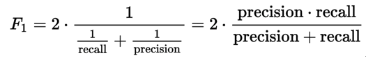
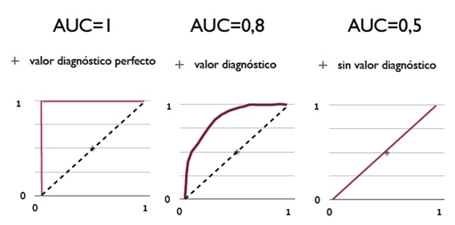

## TF 基础

[TensorFlow](https://www.tensorflow.org/programmers_guide/?hl=zh-cn)

### 数据流图

[数据流](https://en.wikipedia.org/wiki/Dataflow_programming)是一种用于并行计算的常用编程模型。在数据流图中，节点表示计算单元，边缘表示计算使用或产生的数据。 

优势：并行处理； 分布式执行；编译；可移植性；

#### tf.Graph

tf.Graph 包含两类信息：

- 图结构：图的节点和边；
- 图集合：便于在 tf.Graph 中存储元数据集合。tf.add_to_collection 函数允许您将对象列表与一个键关联；tf.get_collection 查询与键关联的所有对象。创建 tf.Variable 时，系统会默认将其添加到表示“全局变量”和“可训练变量”的集合中。 

#### 命名空间

TensorFlow 会自动为您的图中的每个指令选择一个唯一名称 。TensorFlow API 提供两种方法来改写指令的名称： 

- tf.Operation 等 API 函数可以接收 name 参数。
- tf.name_scope 可以指定上下文中创建的所有指令添加名称前缀。 名称前缀以 "/" 分隔。

#### 会话

会话会管理 TensorFlow 程序运行时的所有资源。 

- tf.Session.run：tf.Session.run 方法是一种用于运行 tf.Operation 或对 tf.Tensor 求值的主要机制。可以将一个或多个 tf.Operation 或 tf.Tensor 对象传递到 tf.Session.run ，TensorFlow 将执行所需的指令来得到计算结果。
- tf.Session.run 也可以接收 Feed 字典，例如包含 tf.placeholder 张量的图，在 run 之前需要指定 tf.placeholder 的值。

#### 图可视化

图可视化工具是 TensorBoard 的一个组件，可在浏览器中直观呈现您的图的结构。 要创建直观展示，最简单的方法是在创建 tf.summary.FileWriter 时传递 tf.Graph 。

### 数据集

#### 占位符

图可以参数化以便接受外部输入，也称为**占位符**。**占位符**表示承诺在稍后提供值，它就像函数参数。 可以通过 tf.placeholder 声明占位符，在 sess.run 的 feed_dict 参数为占位符提供真正的值。

#### 导入数据


### 层

层将变量和作用于它们的指令打包在一起。 

#### 创建层

要将层应用于输入值，请将该层当做函数来调用。 

```python
x = tf.placeholder(tf.float32, shape=[None, 3])
linear_model = tf.layers.Dense(units=1)
y = linear_model(x)
```

#### 初始化层

层包含的变量必须先初始化，然后才能使用。 

```python
init = tf.global_variables_initializer()
sess.run(init)
```

#### 执行层

`sess.run`

### 训练

1. 定义模型

2. 定义损失

   `tf.losses`

3. 训练

   优化器都是 `tf.train.Optimizer` 的子类。如 `tf.train.GradientDescentOptimizer` 。

   ```
   optimizer = tf.train.GradientDescentOptimizer(0.01)
   train = optimizer.minimize(loss)
   ```

   由于 `train` 是一个指令而不是张量，因此它在运行时不会返回一个值。 

### 保存和恢复变量

#### 保存

`tf.train.Saver` 类别提供了保存和恢复模型的方法。`tf.train.Saver` 构造函数针对图中所有变量或指定列表的变量将 `save` 和 `restore` op 添加到图中。 

```
saver = tf.train.Saver()
save_path = saver.save(sess, "/tmp/model.ckpt")
```

#### 恢复

`tf.train.Saver.restore` 方法以从检查点文件中恢复变量 

```
saver = tf.train.Saver()
saver.restore(sess, "/tmp/model.ckpt")
```

## 比赛内容

### 原数据

文件有4个波段的数据：蓝、绿、红、近红外。 卫星数据为多景数据拼接而成，比赛数据在蓝、绿两个波段有明显的拼接痕迹，而红、近红外波段的拼接痕迹不明显。 

### 评估指标

[机器学习性能评估指标](http://charleshm.github.io/2016/03/Model-Performance/)

和标准答案对比，计算 F1 Score。赛题并不是对整个数据进行标注然后评估，而是对数据进行正负样本的抽样标注。



#### recall 召回率

(T/F)(P/N) ：(T/F) 表示预测结果是否正确，(P/N) 表示预测为正类或负类。

召回率是计算**数据中对正样本预测的正确率**。TP 表示正样本预测为正类，FN 表示正样本预测为负类。（考虑漏警）


#### precision 精准率

精准率是计算**预测结果中预测为正类中的正确率**。TP 正类预测为正类，FP 负类预测为正类。（考虑虚警）


#### accuracy 准确率

计算所有正负样本预测的正确率。(TP + TN) / (TP + TN + FP + FN)

#### ROC 曲线

用来评估正负类阈值对结果的影响。直观上，TPR 代表能将正例分对的概率，FPR 代表将负例错分为正例的概率。在 ROC 空间中，每个点的横坐标是 FPR，纵坐标是 TPR，这也就描绘了分类器在 TP（**真正率**）和 FP（**假正率**）间的 trade-off 。 

$TPR = \cfrac{TP}{TP+FN} $              $FPR = \cfrac{FP}{FP + TN}$

#### AUC

AUC（Area Under Curve）被定义为ROC曲线下的面积，显然这个面积的数值不会大于1。 

随机挑选一个正样本以及一个负样本，分类器判定正样本的值高于负样本的概率就是 AUC 值。 



> 既然已经这么多评价标准，为什么还要使用ROC和AUC呢？因为ROC曲线有个很好的特性：当测试集中的正负样本的分布变化的时候，ROC曲线能够保持不变。在实际的数据集中经常会出现类不平衡（class imbalance）现象，即负样本比正样本多很多（或者相反） 

### 数据处理

#### 预处理

- 将数值按不同的通道缩放到 0~255 之间。这样数据就小很多，可能会损失一定量的信息，但后期尝试发现并没有太大影响，可能局限是在其他部分。
- 将图片切割成 256 * 256 的小图用于训练，切割成 960 * 960 用于标注。总数据量不到 900 项。
- 数据增强：上下，左右反转，随机调整亮度。没有进行旋转以及随机选点切割。

#### 数据划分

- 训练有两种策略：将两年份的图片一起扔进网络，直接预测新建筑。或者由单张图片预测出建筑，然后由两个年份的预测结果得到结果。由于新建筑正样本太少，而且标准不一定一直，容易出错，采用第二种方法。
- 起初将两年份的图片按 3 ：1划分为训练集和测试集，由于同一块区域的不同年份可能分别在训练集和测试集中，从而导致测试结果虚高。因为两年份的图像很大可能很相近。后面将同一块区域的两个年份的数据一起作为训练集或测试集。
- 生成 tfrecords ，便于传到阿里云中对象存储，然后通过免费的数加平台进行训练。

### 网络

#### 采用 U-NET

- 先对数据归一化，然后通过一层卷积扩充为 8 通道
- 然后通过 5 块的 conv_conv_pool 其中每个卷积后面加了 BN ，用 relu 作为激活函数，采用 max_pooling 。3*3 的卷积 padding 为 "same" 。
- 然后经过不带 pooling 的 conv_conv_pool 。得到 `64*8*8` 的特征图
- 然后经过 5 次上采样+通道拼接以及不带 pooling 的 conv_conv_pool 得到 `8*256*256`的特征图
- 最后一层通过激活函数为 sigmoid 的卷积得到结果。

#### 损失函数

以 IOU (intersection-over-union) 作为损失函数，与 F1-score 类似。

$IOU = \frac{DetectionResult \bigcap Ground Truth }{DetectionResult \bigcup Ground Truth} $

#### 优化器

Adam